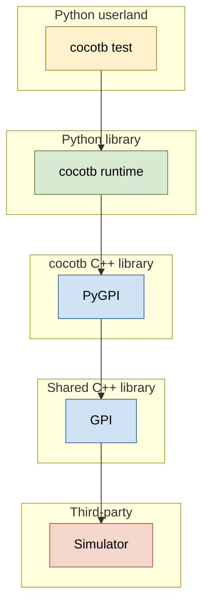
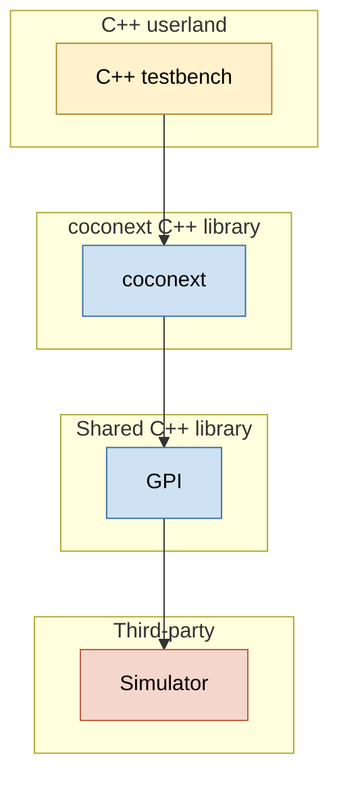
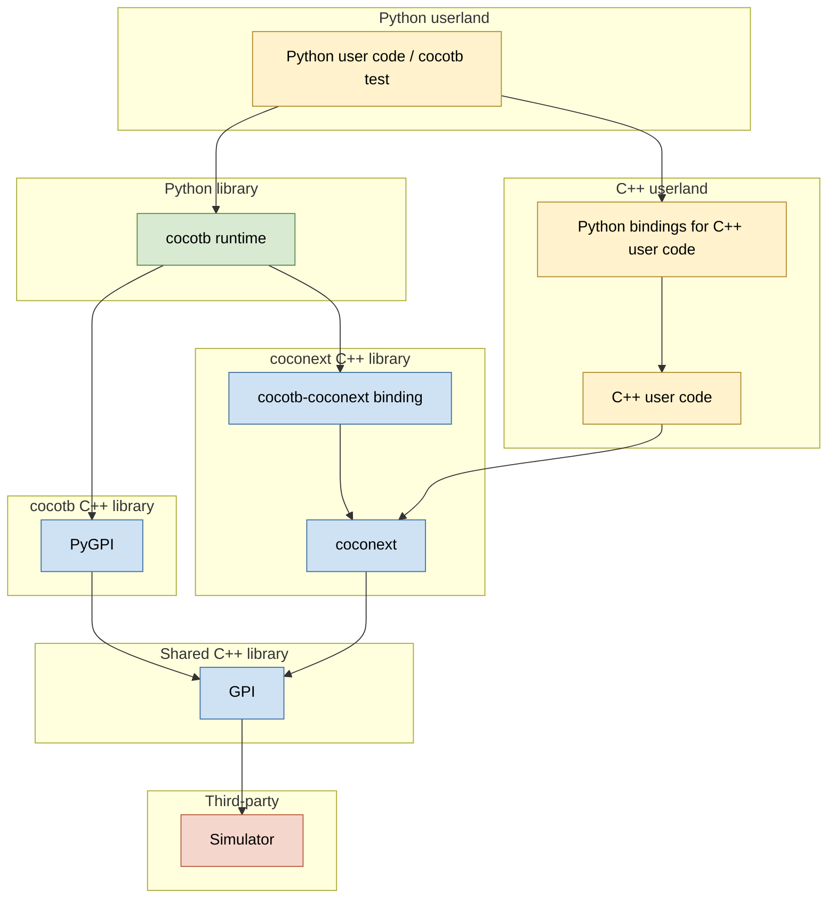

# Project Architecture

Working notes on how coconext relates to cocotb and where it sits in the
simulator/GPI stack.

## cocotb today

cocotb wraps the simulator in successive layers, terminating in a Python test
written by the user.

Layers, bottom to top:

- **Simulator** (third-party). Provides VPI/VHPI/FLI.
- **GPI** (shared C++ library). Normalizes the simulator-specific APIs into a
  single C++ API. Owned by cocotb today, but not Python-specific; intended to
  be the common base for any wrapper.
- **PyGPI** (cocotb C++ library). Embeds CPython and exposes GPI to Python.
- **cocotb runtime** (Python). Scheduler, handles, triggers, decorators.
- **cocotb test** (Python userland). What the user actually writes.

## coconext

coconext replaces the PyGPI + cocotb-runtime stack with a single C++ library.
The user writes a C++ testbench directly against it.

Layers, bottom to top:

- **Simulator** (third-party). Unchanged.
- **GPI** (shared C++ library). Unchanged; same library used by PyGPI.
- **coconext** (coconext C++ library). Subsumes the role of PyGPI + cocotb
  runtime: handle wrappers, scheduler, triggers, test-harness primitives.
- **C++ testbench** (C++ userland). What the user writes.

## cocotb and coconext together

Both stacks share GPI underneath. A binding library exposes coconext to the
cocotb runtime so existing Python tests can drive coconext-based components,
and Python user code can additionally call into the user's own C++ code via
Python bindings.

Key paths:

- **Pure cocotb path**: `cocotb test -> cocotb runtime -> PyGPI / coconext via bindings -> GPI`.
- **Pure coconext path**: `C++ testbench -> coconext -> GPI`.
- **Mixed path (Python driving coconext)**: `cocotb test -> cocotb runtime ->
  cocotb-coconext binding -> coconext -> GPI`.
- **Mixed path (Python calling user C++)**: `Python user code -> Python
  bindings -> user's C++ -> coconext -> GPI`.

PyGPI and coconext are siblings over GPI; the only coupling between them is
through the optional binding shim, so a pure-C++ deployment doesn't pull in
CPython.

coconext also provides a patcher so in this mode parts of the cocotb runtime
are overwritten with coconext implementations (exposed via nanobind) to
1. Improve general cocotb performance slightly.
2. Improve performance and features of Python test code that shares coconext
   objects with C++ test code.
